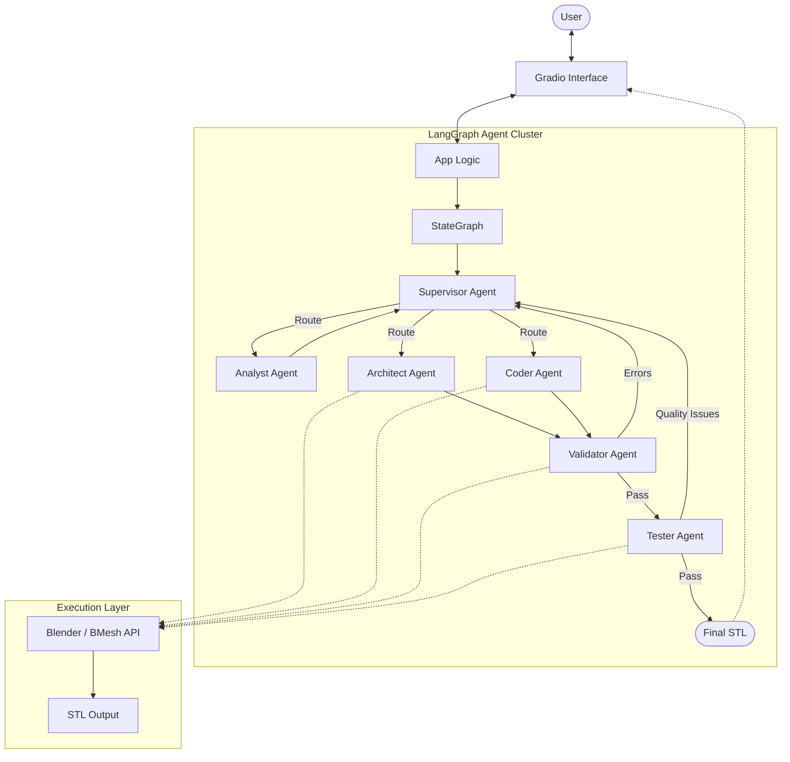

<p align="center">
  
</p>

# 🛠️ 3D Designer Agent (v2.0)

An autonomous, multi-agent 3D engineering system powered by **LangGraph**, **Gradio**, and the **Blender Python (BPY)** API. This agent doesn't just generate models; it performs reverse-engineering, validates code execution, and runs advanced mesh quality assurance.

## 🚀 Key Features

### 🧠 Intelligent Orchestration
- **Decision-Making Supervisor**: Intelligently routes requests between specialized agents based on user intent (e.g., Designing vs. Scripting).
- **Chain-of-Thought (CoT)**: The Analyst Agent generates natural language reasoning traces before creating blueprints, ensuring logical structural decomposition.

### 🎨 Modeling Capabilities
- **Analyst-Architect Flow**: The standard path for complex designs. `Analyst` breaks down 2D concepts into JSON blueprints, and `Architect` synthesizes precise BPY code.
- **Direct Coder Path**: A specialized `Coder Agent` for "procedural" or "scripting" requests that bypasses blueprinting for direct, low-level Blender control.

### 🧪 Advanced Quality Assurance
- **Code Validation**: Real-time execution of BPY scripts in a headless Blender environment to ensure zero syntax errors.
- **Mesh Integrity Testing**: A new `Tester Agent` uses the `bmesh` engine to detect 3D-printing issues:
  - **Non-manifold edges** (watertightness check)
  - **Degenerate geometry** (zero-area faces)
  - **Self-intersections**
- **Self-Correction Loop**: If validation or testing fails, the system automatically feeds the errors/logs back to the agent for recursive fixes (up to 3 retries).

### 🖥️ Modern Workspace UI
- **Split-Pane Inspector**: View the **Blueprint (JSON)**, **Generated Code**, and **Technical Quality Report** side-by-side with the results.
- **3D Preview**: Interactive WebGL rendering of generated STL models.
- **Rich Logging**: Colorful, detailed terminal logs with full stack trace capture for easy debugging.

---

## 🛠️ Architecture

The system utilizes a complex LangGraph workflow to manage state and coordination across multiple specialized agents.

### System Topology


---

## 📦 Installation & Setup

### 1. Prerequisites
- **Python 3.11+**
- **Blender**: The agent requires a Blender environment. Install the high-performance `bpy` module:
  ```bash
  pip install bpy
  ```

### 2. Configuration
Create a `.env` file in the root directory:
```env
LITELLM_MODEL=openai/gpt-4o  # Or your preferred model
LITELLM_API_KEY=your_key
LITELLM_BASE_URL=your_proxy_url
```

### 3. Launch
Run the automated bootstrapper:
```powershell
./run.bat
```
The interface will be available at `http://127.0.0.1:7860`.

---

## 📄 Core Modules
- **`src/agents/`**: LLM logic for Analyst, Architect, Coder, Supervisor, and Tester.
- **`src/utils/blender_ops.py`**: The bridge between Python and Blender's internal modeling engine.
- **`src/graph.py`**: The state machine logic and routing rules.
- **`src/config/logger.py`**: Custom colorful logging system with traceback integration.

## 📝 Recent Version Changes
- [x] Added **Tester Agent** with BMesh integrity checks.
- [x] Added **Coder Agent** for direct scripting.
- [x] Implemented **Chain-of-Thought** reasoning in the Specialist layer.
- [x] Overhauled UI with **Quality Report** and **Enhanced Logging**.
