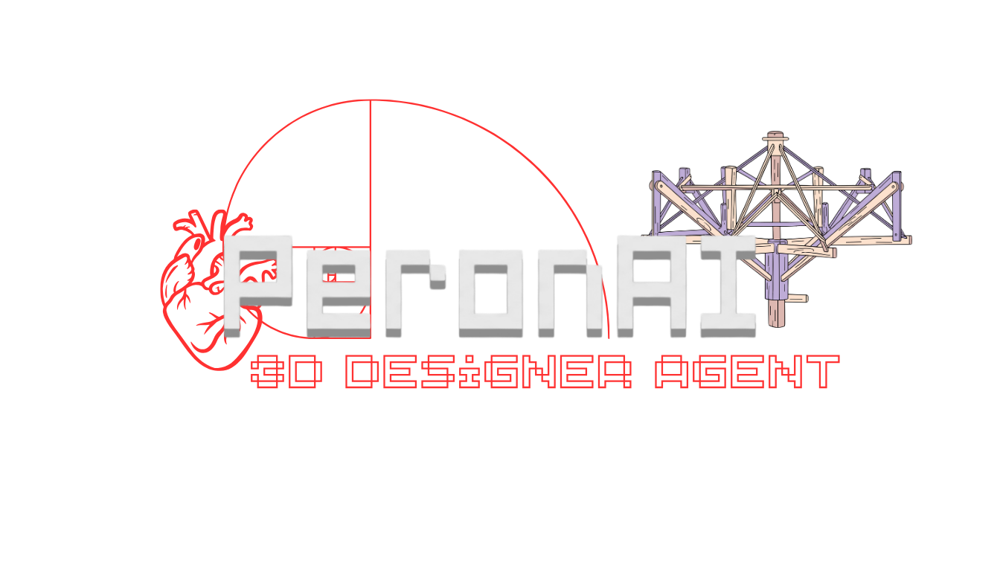
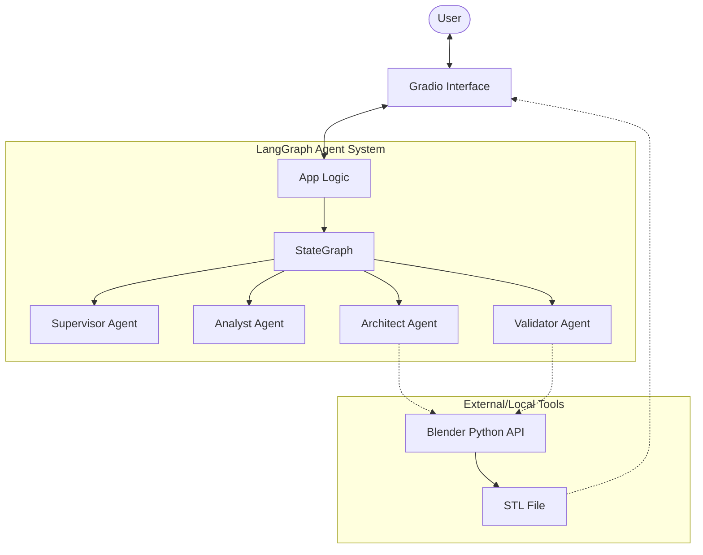
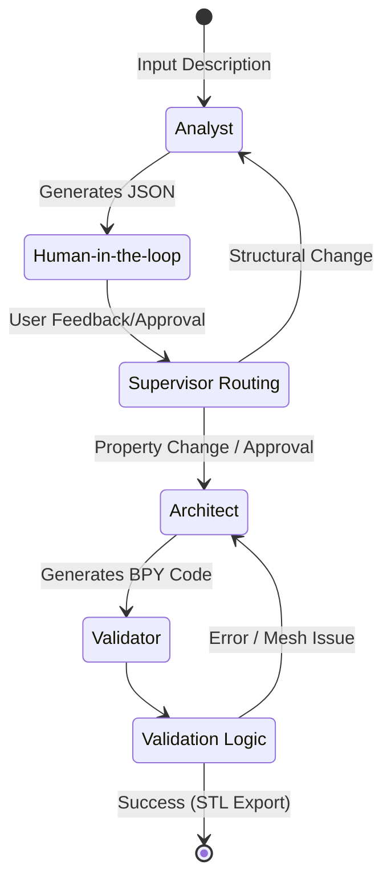

<p align="center">
  
</p>

# 3D Designer Agent

An autonomous 3D modeling assistant powered by **LangGraph**, **Gradio**, and **Blender Python (BPY)**.

## 🚀 Features
- **Visual Decomposition**: Analyzes text/images and breaks them down into geometric primitives (Analyst Agent).
- **BPY Code Generation**: Synthesizes executable Blender Python scripts from blueprints (Architect Agent).
- **Self-Correction**: Uses a background Blender instance to validate and fix mesh issues (Validator Agent).
- **Human-in-the-Loop**: Interrupts flow for user review and feedback on intermediate JSON blueprints.
- **Instant Preview**: Renders the final STL directly in the Gradio UI using `Model3D`.

## 🛠️ Architecture
The system follows a multi-agent orchestration pattern using LangGraph.

### System Diagram


### Agent Workflow


## 📦 Installation & Setup

### Prerequisites
- Python 3.10+
- **Blender**: Ensure Blender is installed. For full functionality, it is recommended to run the agent within Blender's Python environment or install the `bpy` module:
  ```bash
  pip install bpy
  ```

### Quick Start
1. Clone the repository.
2. Run the launch script:
   ```powershell
   ./run_agent.bat
   ```
3. Open the UI at `http://127.0.0.1:7860`.

## 📄 Documentation
- [Implementation Plan](.gemini/antigravity/brain/955fb482-6d34-4030-bf9d-479a18805ca3/implementation_plan.md)
- [System Architecture Details](.gemini/antigravity/brain/955fb482-6d34-4030-bf9d-479a18805ca3/architecture.md)
- [User Walkthrough](.gemini/antigravity/brain/955fb482-6d34-4030-bf9d-479a18805ca3/walkthrough.md)
